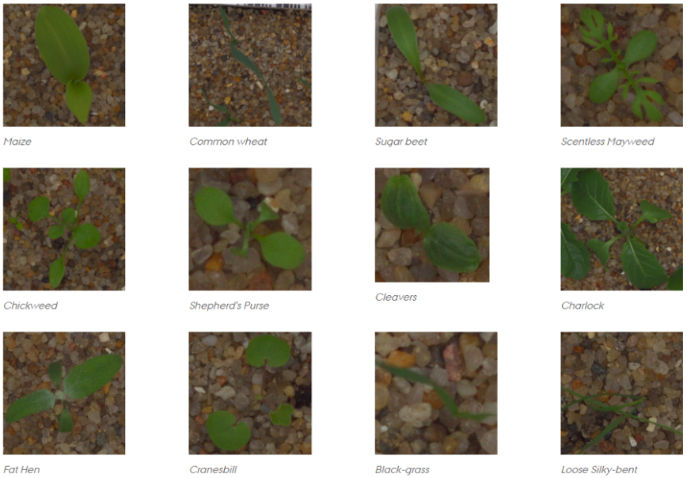
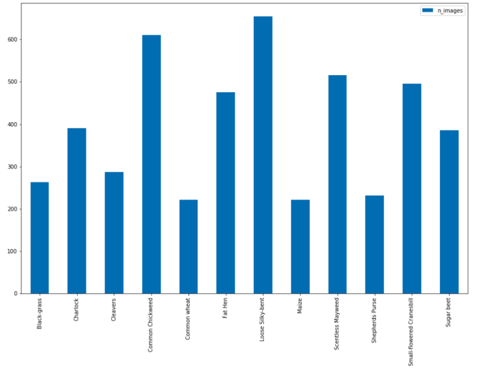

# Plant-seedlings-classification

This repository contains the implementation of a convolutional neural network for classifying plant seedlings in 12 classes.
The ability to do so effectively can mean better crop yields and better stewardship of the environment.

## Dataset

This project uses data from the [Plant Seedlings Classification](https://www.kaggle.com/c/plant-seedlings-classification) competition on kaggle.
 
The Aarhus University Signal Processing group, in collaboration with University of Southern Denmark, released a dataset 
containing images of approximately 960 unique plants belonging to 12 species at several growth stages.
It comprises annotated RGB images with a physical resolution of roughly 10 pixels per mm.
There are a total of 4750 images.

## Technologies

The project is created with:
- Python 3.5+
- [Pytorch](http://pytorch.org/)
- [Imbalanced-learn](https://imbalanced-learn.readthedocs.io/en/stable/api.html)

## Class Imbalance

As seen from the above plot, the distribution of images is not even and the class distribution varies from maximum of 
654 images to a minimum of 221 images.  This clearly demonstrates the data is imbalanced and the data need to be balanced 
in order to get the best results. 

## SMOTE: Synthetic Minority Over-sampling Technique

In order to have a balanced dataset, the [SMOTE](https://jair.org/index.php/jair/article/view/10302/24590) technique is used.
This involves over sampling the minority class and under sampling of the majority class to get the best results.
This technique is used to generate 2487 synthetic images making a total of 7237 images in the training set.

## Results

- Base model without oversampling achieves a validation set accuracy of 94.19% and a MeanFScore of 0.89420 on the  
public leaderboard on kaggle. 
  - run `base_model.ipynb`

- Model that uses oversampling to balance the dataset achieves a validation set accuracy of 97.15% and a MeanFScore 
of 0.97732 on the public leaderboard on kaggle.
  - run `model_balanced.ipynb`
